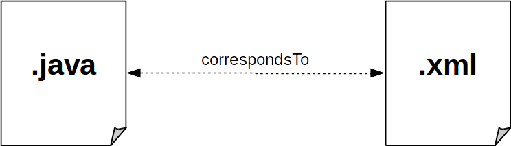
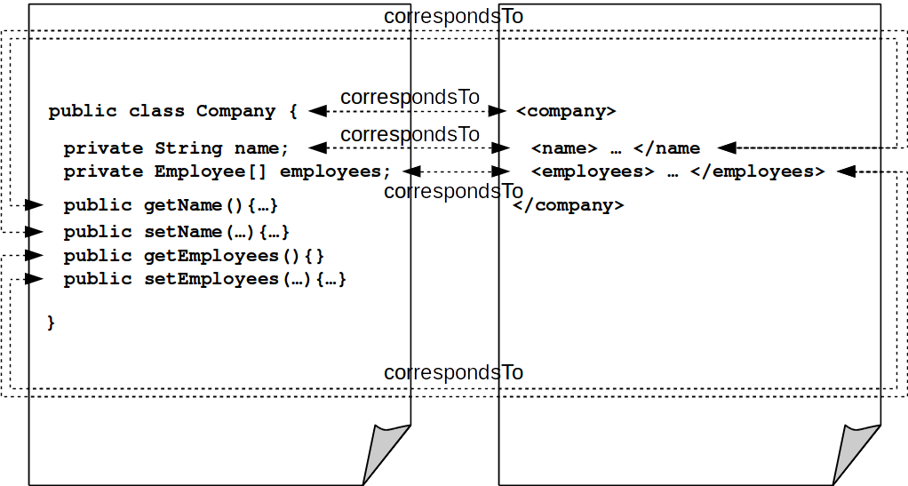

# megal-tr : Traceability Recovery for MegaL

## Disclaimer
**This porject is part of my BSc-Thesis in Computer Science (Informatik).**
It is also related to the Software Ontology research of the [Softlang Working Group](http://softlang.wikidot.com/) at the [University of Koblenz-Landau](http://www.uni-koblenz-landau.de).

## Objective
This project aims to *recover* the low-level relationships between fragments of two artifacts.
Lets say we declared a relationship between two files in MegaL:

We want to recover the same relationship beween the low-level parts of those files:

## References

## Links
- [University of Koblenz-Landau](http://www.uni-koblenz-landau.de)
- [Softlang Working Group](http://softlang.wikidot.com/)
- [MegaL GitHub Repository](https://github.com/avaranovich/megal-xtext)
